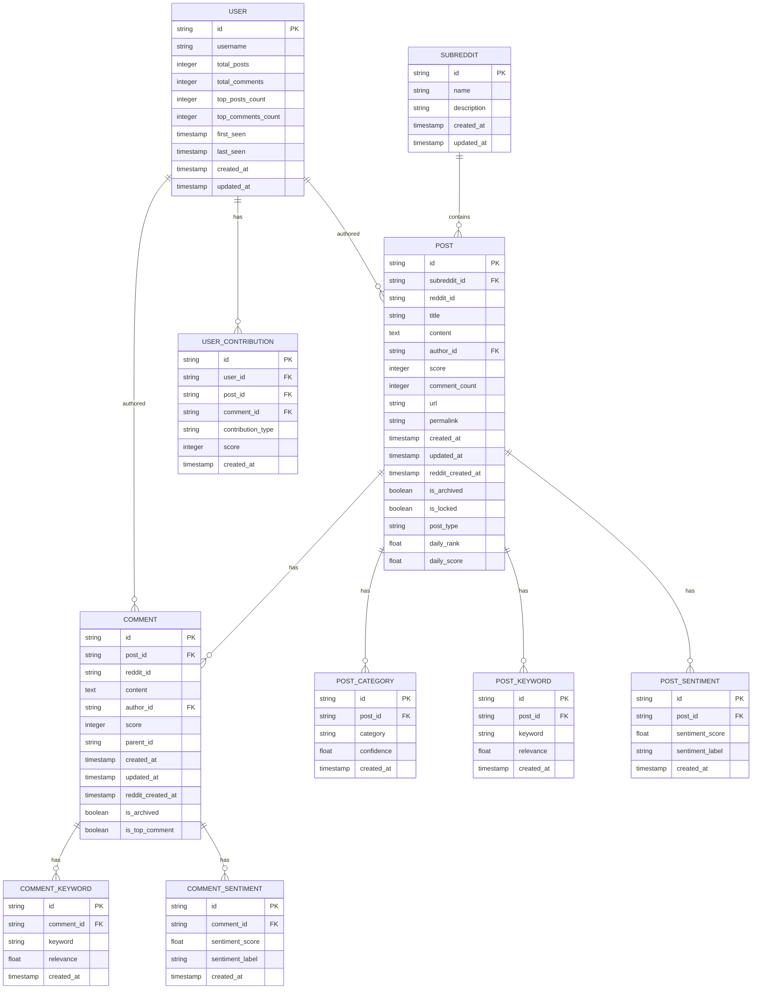

# Database Schema Design

## Entity Relationship Diagram

## Schema Details

### Tables

#### 1. subreddits
- Primary tracking table for Portland-related subreddits
- Stores basic subreddit information
- Used for managing which subreddits to scrape

#### 2. posts
- Stores all Reddit posts from tracked subreddits
- Includes metadata like scores, comment counts, and URLs
- Links to subreddit through foreign key
- Tracks both Reddit's creation time and our record creation time
- Added `daily_rank` and `daily_score` for post ranking
- Links to user through `author_id`

#### 3. comments
- Stores all comments from tracked posts
- Links to parent post through foreign key
- Includes metadata like scores and parent comment references
- Tracks both Reddit's creation time and our record creation time
- Added `is_top_comment` flag for tracking top comments
- Links to user through `author_id`

#### 4. users
- Tracks Reddit users who post or comment
- Stores user statistics and contribution counts
- Tracks first and last seen timestamps
- Used for identifying key community members

#### 5. user_contributions
- Tracks individual contributions by users
- Links users to their posts and comments
- Stores contribution scores and types
- Used for calculating user rankings

#### 6. post_categories
- Stores post categorization data
- Used for Phase 2's post type tracking feature
- Includes confidence scores for categorization

#### 7. post_keywords
- Stores extracted keywords from posts
- Used for Phase 3's keyword extraction feature
- Includes relevance scores for each keyword

#### 8. comment_keywords
- Stores extracted keywords from comments
- Similar to post_keywords but for comment content
- Used for comment analysis and tracking

#### 9. post_sentiment
- Stores sentiment analysis results for posts
- Used for Phase 3's sentiment analysis feature
- Includes both numerical scores and human-readable labels

#### 10. comment_sentiment
- Stores sentiment analysis results for comments
- Similar to post_sentiment but for comment content
- Used for comment sentiment tracking

## Notes

1. **Timestamps**:
   - `created_at`: When we first stored the record
   - `updated_at`: When we last updated the record
   - `reddit_created_at`: When the content was created on Reddit
   - `first_seen`: When we first saw a user
   - `last_seen`: When we last saw a user

2. **IDs**:
   - `id`: Our internal UUID
   - `reddit_id`: Reddit's unique identifier
   - `parent_id`: For comments, references parent comment or post
   - `author_id`: Links to user table

3. **Scoring**:
   - `score`: Reddit's upvote count
   - `confidence`: For categorization accuracy
   - `relevance`: For keyword importance
   - `sentiment_score`: For sentiment analysis results
   - `daily_score`: Combined score for post ranking
   - `daily_rank`: Post's rank for the day

4. **Future Considerations**:
   - Indexes on frequently queried fields
   - Partitioning for large tables
   - Archival strategy for old data
   - Caching for user statistics 